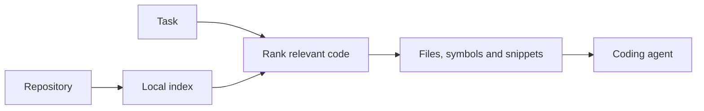

# CallSieve

A local code search tool that helps coding agents find the right files before they start reading a repository. Written in Rust, with a CLI and an MCP server.

[](https://github.com/PhilipJohnBasile/callsieve/actions/workflows/ci.yml) [](https://github.com/PhilipJohnBasile/callsieve/releases/latest) [](LICENSE)

## Try it

Install the released CLI on macOS with Homebrew:

```bash
brew install philipjohnbasile/callsieve/callsieve
callsieve demo /path/to/your/repo --task "find where login is handled"
```

Or build from a fresh checkout with **Rust 1.96+**:

```bash
git clone https://github.com/PhilipJohnBasile/callsieve.git
cd callsieve
cargo build --locked
./target/debug/callsieve demo . --task "where is the repository index built?"
```

The demo indexes the chosen repository locally and produces a compact context packet with relevant files and snippets. It writes its index under that repository's `.callsieve/` directory. No API key is required.

## How it works



The default path ranks symbols, paths, imports, tests, and keywords without calling an AI model. The returned text still uses context tokens when the agent reads it. Optional embeddings and LSP enrichment can add information to that baseline.

I built CallSieve to make repository exploration repeatable across different coding agents. The CLI and MCP interfaces share the retrieval layer; hooks and trace reports help check whether an agent actually used the selected context.

## Use it in a workflow

```bash
callsieve index /path/to/repo
callsieve agent-context /path/to/repo "trace the login session handler"
callsieve mcp-config /path/to/repo --format json
```

For editor setup, daemon mode, hooks, and the full command list, see the [reference](docs/REFERENCE.md). The current release is [v0.5.0](https://github.com/PhilipJohnBasile/callsieve/releases/tag/v0.5.0); development on `main` can move ahead of a release.

## Evidence and limitations

[Public benchmarks](benchmarks/public) contain dataset manifests and result files. [Evaluation notes](docs/PRODUCT_BACKGROUND.md) explain the measured subsets and configurations. Retrieval accuracy, estimated context reduction, and observed whole-session token savings are different measures; a retrieval result alone does not establish a reduction in API cost.

Deterministic retrieval can miss vague queries and dynamic relationships. Language support ranges from richer parsers to lightweight heuristics. Use the relevant benchmark and your own repository to decide whether the results are useful.

## Development

```bash
cargo fmt --check
cargo clippy --all-targets -- -D warnings
cargo test --locked
```

[Verification notes](docs/VERIFICATION.md) · [Contributing](CONTRIBUTING.md) · [Change log](CHANGELOG.md) · [Issues](https://github.com/PhilipJohnBasile/callsieve/issues)

## License

[MIT](LICENSE). The local engine is open source; [commercial support](commercial/PRICING.md) is optional.
